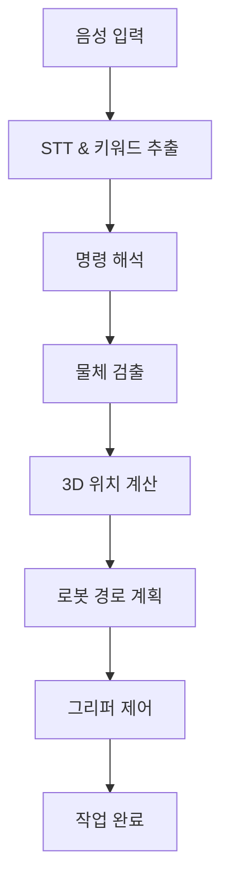

# 🤖 DUM-E: ROS2 기반 두산로보틱스 로봇팔 제어 시스템

[](https://docs.ros.org/en/humble/)
[](https://www.python.org/)
[](LICENSE)

**DUM-E**는 음성 인식을 통해 명령을 받아 물체를 인식하고 집어서 이동시키는 ROS 2 기반의 스마트 로봇팔 제어 시스템입니다.


*음성 명령으로 도구를 가져오는 DUM-E*

## 📋 목차

- [🎯 주요 기능](#-주요-기능)
- [🏗️ 시스템 구조](#️-시스템-구조)
- [⚙️ 설치 및 설정](#️-설치-및-설정)
- [🚀 실행 방법](#-실행-방법)
- [🎮 사용법](#-사용법)
- [📁 프로젝트 구조](#-프로젝트-구조)
- [🤝 기여하기](#-기여하기)
- [📄 라이선스](#-라이선스)

## 🎯 주요 기능

### 🎤 음성 인식 기반 제어
- **웨이크업 워드**: "Hello Rokey"로 시작
- **자연어 명령 처리**: OpenAI GPT-4를 활용한 의도 파악
- **한국어/영어 지원**: 다국어 음성 명령 인식

### 👁️ 컴퓨터 비전
- **YOLO 기반 물체 검출**: 실시간 도구 인식
- **RealSense 카메라**: 깊이 정보를 활용한 3D 위치 추정
- **동적 모델 전환**: 상황별 최적화된 검출 모델 사용

### 🦾 정밀 로봇 제어
- **두산로보틱스 M0609**: 6축 산업용 로봇팔
- **OnRobot RG2 그리퍼**: 적응형 그립 제어
- **힘 제어**: 안전한 물체 집기 및 배치
- **경로 최적화**: 효율적인 동작 계획

## 🏗️ 시스템 구조



### 🔧 주요 컴포넌트

| 컴포넌트 | 기능 | 기술 스택 |
|----------|------|-----------|
| **음성 처리** | 음성 인식 및 명령 해석 | OpenAI Whisper, GPT-4 |
| **물체 인식** | 실시간 도구 검출 | YOLO v8, RealSense |
| **로봇 제어** | 로봇팔 모션 제어 | DSR_ROBOT2, ROS 2 |
| **그리퍼 제어** | 물체 집기/놓기 | OnRobot RG2 |

## ⚙️ 설치 및 설정

### 📋 시스템 요구사항

#### 하드웨어
- 두산로보틱스 M0609 로봇팔
- Intel RealSense D435i 카메라
- OnRobot RG2 그리퍼
- 마이크 (USB 또는 내장)

#### 소프트웨어
- Ubuntu 22.04 LTS
- ROS 2 Humble
- Python 3.8+
- CUDA 11.8+ (GPU 가속용)

### 🚀 설치 과정

1. **저장소 클론**
   ```bash
   git clone https://github.com/Kiloc97/Rokey_DUM-E.git
   cd Rokey_DUM-E
   ```

2. **ROS 2 의존성 설치**
   ```bash
   sudo apt update
   sudo apt install ros-humble-desktop-full
   source /opt/ros/humble/setup.bash
   ```

3. **Python 패키지 설치**
   ```bash
   pip install -r requirements.txt
   ```

4. **환경 변수 설정**
   ```bash
   cp dum_e/resource/.env.example dum_e/resource/.env
   # .env 파일을 열어서 OpenAI API 키 입력
   nano dum_e/resource/.env
   ```

5. **패키지 빌드**
   ```bash
   colcon build --symlink-install
   source install/setup.bash
   ```

### 🔑 API 키 설정

`.env` 파일에 다음 정보를 입력하세요:

```bash
# OpenAI API Key (음성 인식 및 키워드 추출용)
OPENAI_API_KEY=your_openai_api_key_here
```

## 🚀 실행 방법

### 1️⃣ 로봇 연결 확인
```bash
# 로봇 통신 상태 확인
ping 192.168.1.100  # 로봇 IP 주소
```

### 2️⃣ 노드 실행 (3개 터미널 필요)

**터미널 1: 물체 인식 노드**
```bash
source install/setup.bash
ros2 run dum_e object_detection
```

**��미널 2: 음성 처리 노드**
```bash
source install/setup.bash
ros2 run dum_e get_keyword
```

**터미널 3: 로봇 제어 메인 노드**
```bash
source install/setup.bash
ros2 run dum_e robot_control
```

### 3️⃣ 시스템 상태 확인
```bash
# 실행 중인 노드 확인
ros2 node list

# 토픽 확인
ros2 topic list

# 서비스 확인
ros2 service list
```

## 🎮 사용법

### 🗣️ 기본 음성 명령

1. **웨이크업**: "Hello Rokey" 또는 "안녕 로키"
2. **명령 입력**: 원하는 작업 설명
3. **확인**: "Yes", "네", "맞아" 등으로 확인

### 📝 지원 명령어

| 명령어 | 기능 | 예시 |
|--------|------|------|
| `bring` | 도구 가져오기 | "Bring the hammer" |
| `clear` | 도구 정리하기 | "정리해줘" |
| `hold` | 악수하기 | "Hold my hand" |
| `unhold` | 악수 해제 | "Let go" |

### 🔧 인식 가능한 도구들

| 도구명 | 영어 | 한국어 | 용도 |
|--------|------|--------|------|
| `hammer` | Hammer | 망치 | 못 박기 |
| `screwdriver` | Screwdriver | 드라이버 | 나사 조이기 |
| `wrench` | Wrench | 렌치 | 볼트 조이기 |
| `6wrench` | Hex Wrench | 육각렌치 | 육각볼트 |
| `monkey` | Monkey Wrench | 몽키스패너 | 파이프 작업 |
| `pipewrench` | Pipe Wrench | 파이프렌치 | 배관 작업 |
| `knief` | Knife | 칼 | 절단 작업 |
| `voltcup` | Voltage Cup | 전압컵 | 전기 측정 |
| `nutcup` | Nut Cup | 너트컵 | 견과류 보관 |

### 💬 사용 예시

```
👤 사용자: "Hello Rokey"
🤖 DUM-E: [웨이크업 인식]

👤 사용자: "Bring me the hammer and screwdriver"
🤖 DUM-E: "이 명령이 맞나요?"

👤 사용자: "Yes"
🤖 DUM-E: [망치와 드라이버를 찾아서 가져옴]
```

## 📁 프로젝트 구조

```
Rokey_DUM-E/
├── dum_e/                          # 메인 ROS 2 패키지
│   ├── package.xml                 # 패키지 설정
│   ├── setup.py                    # Python 패키지 설정
│   ├── robot_control.py            # 메인 실행 파일
│   ├── object_detection/           # 물체 인식 모듈
│   │   ├── detection.py            # 메인 검출 노드
│   │   ├── yolo.py                 # YOLO 모델 래퍼
│   │   ├── realsense.py            # RealSense 카메라 인터페이스
│   │   └── direction.py            # 방향 감지
│   ├── voice_processing/           # 음성 처리 모듈
│   │   ├── get_keyword.py          # 키워드 추출 메인
│   │   ├── stt.py                  # 음성-텍스트 변환
│   │   ├── wakeup_word.py          # 웨이크업 워드 감지
│   │   ├── MicController.py        # 마이크 제어
│   │   └── teleop_key.py           # 키보드 제어 (개발용)
│   ├── robot_control/              # 로봇 제어 모듈
│   │   ├── robot_control.py        # 로봇 제어 로직
│   │   ├── motion_v2.py            # 모션 계획
│   │   └── onrobot.py              # 그리퍼 제어
│   └── resource/                   # 설정 및 모델 파일
│       ├── .env.example            # 환경변수 템플릿
│       ├── *.pt                    # YOLO 모델 가중치
│       ├── T_gripper2camera.npy    # 카메라 변환 행렬
│       └── class_name_tool.json    # 클래스 매핑
├── dum_e_interface/                # 커스텀 메시지/서비스
│   ├── srv/                        # 서비스 정의
│   │   ├── Command.srv             # 명령 서비스
│   │   └── SrvDepthPosition.srv    # 위치 서비스
│   └── action/                     # 액션 정의
│       └── ActionDetection.action  # 검출 액션
├── .gitignore                      # Git 제외 파일 목록
└── README.md                       # 프로젝트 문서
```

## 🔧 고급 설정

### 📊 성능 튜닝

**GPU 가속 활성화:**
```bash
# CUDA 설치 확인
nvidia-smi

# GPU 메모리 설정
export CUDA_VISIBLE_DEVICES=0
```

**카메라 설정 최적화:**
```python
# realsense.py에서 해상도/FPS 조정
pipeline.start(config)
```

### 🎯 정확도 향상

**YOLO 모델 학습:**
```bash
# 커스텀 데이터셋으로 재학습
python train.py --data custom_tools.yaml --weights yolov8n.pt
```

**음성 인식 개선:**
```python
# STT 모델 변경 (stt.py)
model = whisper.load_model("large-v2")
```

## 🛠️ 문제 해결

### 자주 발생하는 문제들

**Q: 로봇과 연결이 안 됩니다**
```bash
# 네트워크 연결 확인
ping 192.168.1.100

# 방화벽 설정 확인
sudo ufw status
```

**Q: 음성 인식이 작동하지 않습니다**
```bash
# 마이크 장치 확인
arecord -l

# 권한 설정
sudo usermod -a -G audio $USER
```

**Q: 물체 인식 정확도가 낮습니다**
```bash
# 조명 환경 확인
# 카메라 높이 조정
# 모델 재학습 고려
```

## 🤝 기여하기

프로젝트에 기여하고 싶으시다면:

1. **Fork** 하기
2. **Feature branch** 생성 (`git checkout -b feature/AmazingFeature`)
3. **변경사항 커밋** (`git commit -m 'Add some AmazingFeature'`)
4. **Branch에 Push** (`git push origin feature/AmazingFeature`)
5. **Pull Request** 생성

### 📝 개발 가이드라인

- 코드 스타일: PEP 8 준수
- 테스트: 새 기능은 테스트 코드 포함
- 문서: docstring 및 주석 작성
- 커밋: 의미있는 커밋 메시지

## 📞 지원 및 연락

- **이슈 리포트**: [GitHub Issues](https://github.com/Kiloc97/Rokey_DUM-E/issues)
- **기능 요청**: [GitHub Discussions](https://github.com/Kiloc97/Rokey_DUM-E/discussions)
- **이메일**: leejinwon@todo.todo

## 📄 라이선스

이 프로젝트는 MIT 라이선스 하에 배포됩니다. 자세한 내용은 [LICENSE](LICENSE) 파일을 참조하세요.

## 🙏 감사의 말

- **두산로보틱스**: 로봇팔 하드웨어 및 SDK 지원
- **OnRobot**: 그리퍼 하드웨어 지원
- **Intel**: RealSense 카메라 및 라이브러리
- **OpenAI**: 음성 인식 및 자연어 처리 API
- **Ultralytics**: YOLO 객체 검출 모델

---

<div align="center">

**⭐ 이 프로젝트가 유용하다면 스타를 눌러주세요! ⭐**

Made with ❤️ by [Kiloc97](https://github.com/Kiloc97)

</div>